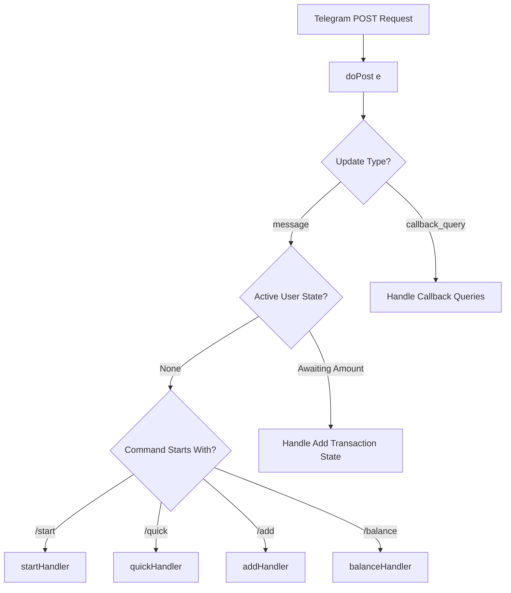

# Google Apps Script Migration Guide & Architectural Plan

This guide outlines the architectural plan and step-by-step refactoring steps required to migrate the Telegram chatbot project from its Python, SQLite, and `python-telegram-bot` stack to run natively on Google Apps Script (GAS) using TypeScript (compiled and deployed via `clasp`).

---

## 1. Architectural Comparison

| Architectural Dimension | Python Codebase (Current) | Google Apps Script (Target) |
| :--- | :--- | :--- |
| **Execution Model** | Long-running stateful process (polling/asynchronous loop). | Stateless, event-driven execution triggered by incoming Webhook HTTP POST requests. |
| **Lifecycle** | Stays alive in memory across messages; maintains async task loops. | Spawns a new VM instance for each incoming update, executes synchronously, and immediately terminates. |
| **Database** | SQLite (local file-based relational database). | Google Sheets (relational row/column design using the Spreadsheet service). |
| **Session State** | In-memory `context.user_data` dictionary. | Persistent key-value storage via `PropertiesService` or `CacheService`. |
| **HTTP Client** | `httpx` (async) or `requests`. | Native `UrlFetchApp` service. |
| **Telegram API Wrapper**| `python-telegram-bot` (handles updates, callbacks, and inline keyboard models). | Direct raw HTTP calls to `https://api.telegram.org/bot<TOKEN>/<method>` via `UrlFetchApp`. |
| **Authentication** | Mandatory Google OAuth2 redirect flow. | Pre-authenticated in script deployer's execution context (Single-User mode). |

---

## 2. File Mapping

To maintain a clean and modular codebase under Google Apps Script, we map the current Python project files to TypeScript modules as follows:

| Python Source File | Apps Script Target File | Purpose / Details |
| :--- | :--- | :--- |
| `config.py` | `config.ts` | Stores constants like Telegram Bot Token, Google Sheet IDs, and configuration properties. Config values are loaded dynamically from Script Properties. |
| `db.py` | `database.ts` | Replaces SQLite SQL statements with Google Sheets read/write operations using `SpreadsheetApp`. |
| `sheets.py` | `sheets.ts` | Replaces complex sheets API calls with GAS `SpreadsheetApp` operations for creating worksheets dynamically and formatting monthly summaries. |
| `bot.py` | `main.ts`<br>`router.ts`<br>`handlers.ts` | **`main.ts`**: Contains the webhook entrypoint `doPost(e)`.<br>**`router.ts`**: Routes incoming commands/messages stateless.<br>**`handlers.ts`**: Implements handlers for `/add`, `/quick`, `/balance`, `/view`, `/clear`. |
| `.env` | *Script Properties* | Environmental variables are saved in Google Apps Script under **Project Settings > Script Properties** and accessed via `PropertiesService.getScriptProperties()`. |
| `tests/` | `tests/` | Unit tests are written locally in TypeScript and run via Jest before compilation/deploy. |

---

## 3. Webhook Execution Model & Registration

### 3.1 Webhook Execution (`doPost`)
In Google Apps Script, webapps handle incoming HTTP POST requests via a global `doPost(e)` function. The parameter `e` contains event metadata, including the request payload under `e.postData.contents`.
Because Google Apps Script runs under a strict stateless request-response model, the bot must:
1. Instantly parse the payload to extract the Telegram Update object.
2. Complete all execution paths (including external API calls and Spreadsheet updates) synchronously.
3. Respond to Telegram with a standard `200 OK` response to confirm receipt.

> [!IMPORTANT]
> Since GAS webapp executions terminate immediately when `doPost` returns, any asynchronous tasks launched via `setTimeout` or async callbacks will be aborted. All HTTP requests (`UrlFetchApp`) and DB operations must be synchronous.

### 3.2 Webhook Registration
To redirect Telegram messages to the Google Apps Script Web App, register its URL with Telegram using the `setWebhook` API method.

**Register Webhook Command:**
```bash
curl -X POST "https://api.telegram.org/bot<TELEGRAM_BOT_TOKEN>/setWebhook" \
     -H "Content-Type: application/json" \
     -d '{"url": "<YOUR_APPS_SCRIPT_WEB_APP_URL>"}'
```

**Verify Webhook Status:**
```bash
curl -G "https://api.telegram.org/bot<TELEGRAM_BOT_TOKEN>/getWebhookInfo"
```

**Unregister Webhook:**
```bash
curl -X POST "https://api.telegram.org/bot<TELEGRAM_BOT_TOKEN>/deleteWebhook"
```

---

## 4. Command Routing Architecture

Because Apps Script is stateless and lacks a built-in router like `python-telegram-bot`'s `ConversationHandler`, routing must be handled manually. 

### 4.1 Stateless Update Router
We implement a lightweight router that:
1. Inspects the incoming `Update` type (e.g., `message` or `callback_query`).
2. Retrieves the sender's current conversation state from `PropertiesService`.
3. Dispatches the update to the correct handler based on the command prefix or active state.



### 4.2 State Machine Transition
State transitions (such as during interactive transaction logging: `State 1: Type -> State 2: Amount -> State 3: Description`) are saved to `PropertiesService.getUserProperties()` keyed by the Telegram User ID, mapping the exact behavior of `python-telegram-bot`'s `ConversationHandler`.

## 5. System Migration & Google Apps Script Limitations

### 5.1 Database Migration (SQLite to Google Sheets)
In the Python codebase, transaction logs are stored in a SQLite database. In Google Apps Script, we migrate this database to worksheets in a Google Spreadsheet.

#### Schema Mapping:
Each row in the worksheet represents one transaction record. We map the SQLite fields to worksheet columns:
*   **Column A: user_id** (matches Telegram User ID)
*   **Column B: id** (unique auto-incrementing integer or row index)
*   **Column C: date** (string in ISO-8601 format: `YYYY-MM-DD`)
*   **Column D: amount** (positive number)
*   **Column E: description** (text note)
*   **Column F: type** (`debit` or `credit`)
*   **Column G: balance_after** (recalculated running balance cached after row insertion)

#### Multi-User Isolation:
To isolate transactions between users, the spreadsheet engine can either:
1.  **Filter by User ID**: Store all records in a single sheet and query/filter by the `user_id` column.
2.  **Separate Worksheets**: Dynamically create a new worksheet tab for each Telegram User ID (e.g. `User_<user_id>_Transactions`). This isolates data completely and keeps individual tabs small.

---

### 5.2 Session & State Management
Without a persistent server memory, session properties are stored in `PropertiesService.getUserProperties()` which provides a persistent, stateless key-value store scoped to the current user executing the script:
*   **Active State**: Store user conversation states (e.g. `{"state": "AWAITING_AMOUNT"}`) under key `STATE_<telegram_user_id>`.
*   **Temporary Data**: Store incomplete transaction details under key `TEMP_TX_<telegram_user_id>`.
*   **Google OAuth2 Tokens**: Store user Google credentials securely.

---

### 5.3 Library & Dependency Mapping

Google Apps Script does not support npm/pip packages natively. The table below outlines how to replace major project dependencies:

| Python Library | Apps Script Native Equivalent |
| :--- | :--- |
| `python-telegram-bot` | Raw HTTP POST calls to Telegram Bot API using `UrlFetchApp.fetch()`. |
| `sqlite3` | `SpreadsheetApp.getActiveSpreadsheet()` or `SpreadsheetApp.openById()`. |
| `google-api-client` | Built-in Google Services like `SpreadsheetApp` and `DriveApp` (no client libraries or OAuth authorization headers required when running in owner's context). |
| `python-dotenv` | Project Settings > Script Properties accessed via `PropertiesService.getScriptProperties().getProperty()`. |

---

### 5.4 Google Apps Script Environment Constraints

When refactoring, the following system limitations must be actively managed:

1.  **Execution Time Limit**:
    *   **Webhook / Web App calls (`doPost`)**: Max **30 seconds** execution time per request.
    *   **Custom Functions / Triggers**: Max **6 minutes** execution time.
    *   *Mitigation*: Batch sheet reads/writes using `.getValues()` and `.setValues()` instead of looping over single cells. Keep calculations in memory.
2.  **Simultaneous Access / Lock Service**:
    *   Since multiple users might send messages at the same time, simultaneous database operations can lead to race conditions.
    *   *Mitigation*: Use `LockService.getScriptLock()` to prevent concurrent writes to the same spreadsheet.
3.  **URL Fetch Quota**:
    *   Apps Script restricts the number of external HTTP calls (`UrlFetchApp.fetch`) per day (typically 20,000 for standard accounts). Keep updates clean and avoid polling/unnecessary API requests.
4.  **Google Sheets Limits**:
    *   A single spreadsheet file is limited to 10 million cells. Clean up or archive old transactions once sheets grow excessively large.

---

### 5.5 Error Handling & Logging

In Google Apps Script, stdout/stderr are logged to Google Cloud Logs. 
1.  **Cloud Logging**: Use `console.log()` and `console.error()` for debugging. Logs are accessible in the Google Cloud Console or via the Apps Script Executions dashboard.
2.  **Spreadsheet Logging**: For critical errors that need immediate user visibility or audits, implement an `errorLogSheet` tab where unhandled exceptions are appended as rows.

---

## 6. TypeScript Code Snippets & Implementation Mappings

The following copy-pasteable TypeScript code snippets demonstrate how to implement the core modules in Google Apps Script.

### 6.1 Webhook Entrypoint (`main.ts`)
Handles the event-driven entry point `doPost(e)` for incoming Telegram webhooks.

```typescript
interface TelegramUpdate {
  update_id: number;
  message?: {
    message_id: number;
    from: { id: number; is_bot: boolean; first_name: string; username?: string };
    chat: { id: number; type: string };
    text?: string;
  };
  callback_query?: {
    id: string;
    from: { id: number; first_name: string; username?: string };
    message?: { message_id: number; chat: { id: number }; text: string };
    data: string;
  };
}

/**
 * Handles incoming Telegram Webhook updates.
 */
function doPost(e: GoogleAppsScript.Events.DoPost) {
  try {
    const contents = JSON.parse(e.postData.contents) as TelegramUpdate;
    console.log("Received Update:", JSON.stringify(contents));

    const token = PropertiesService.getScriptProperties().getProperty("TELEGRAM_BOT_TOKEN");
    if (!token) {
      throw new Error("Missing TELEGRAM_BOT_TOKEN Script Property.");
    }

    // Process update stateless
    routeUpdate(contents, token);

    // Return success to Telegram
    return ContentService.createTextOutput(JSON.stringify({ ok: true }))
                         .setMimeType(ContentService.MimeType.JSON);
  } catch (error) {
    console.error("Error handling doPost:", error);
    logErrorToSheet(error);
    return ContentService.createTextOutput(JSON.stringify({ ok: false, error: error.message }))
                         .setMimeType(ContentService.MimeType.JSON);
  }
}

function logErrorToSheet(error: any) {
  try {
    const ssId = PropertiesService.getScriptProperties().getProperty("SPREADSHEET_ID");
    const ss = ssId ? SpreadsheetApp.openById(ssId) : SpreadsheetApp.getActiveSpreadsheet();
    let sheet = ss.getSheetByName("ErrorLogs");
    if (!sheet) {
      sheet = ss.insertSheet("ErrorLogs");
      sheet.appendRow(["Timestamp", "Message", "Stack"]);
    }
    sheet.appendRow([new Date(), error.message, error.stack]);
  } catch (e) {
    console.error("Failed to write to ErrorLogs sheet:", e);
  }
}
```

---

### 6.2 Lightweight Stateless Router (`router.ts`)
Inspects updates, tracks properties-based state, and dispatches actions to handlers.

```typescript
function routeUpdate(update: TelegramUpdate, token: string) {
  if (update.message) {
    const chat_id = update.message.chat.id;
    const user_id = update.message.from.id;
    const text = update.message.text?.trim() || "";

    const userProperties = PropertiesService.getUserProperties();
    const activeState = userProperties.getProperty(`STATE_${user_id}`);

    if (activeState) {
      handleStatefulMessage(user_id, chat_id, text, activeState, token);
      return;
    }

    if (text.startsWith("/")) {
      const parts = text.split(" ");
      const command = parts[0].toLowerCase();
      const args = parts.slice(1).join(" ");

      switch (command) {
        case "/start":
          sendTelegramMessage(chat_id, "Welcome to Savings Tracker Bot! Use /add or /quick to start logging transactions.", token);
          break;
        case "/quick":
          handleQuickCommand(user_id, chat_id, args, token);
          break;
        case "/balance":
          handleBalanceCommand(user_id, chat_id, token);
          break;
        case "/add":
          startAddFlow(user_id, chat_id, token);
          break;
        default:
          sendTelegramMessage(chat_id, "Unknown command. Try /add, /quick, /balance, /help.", token);
      }
    }
  } else if (update.callback_query) {
    handleCallbackQuery(update.callback_query, token);
  }
}

function sendTelegramMessage(chatId: number, text: string, token: string, replyMarkup?: any) {
  const url = `https://api.telegram.org/bot${token}/sendMessage`;
  const payload = {
    chat_id: chatId,
    text: text,
    parse_mode: "HTML",
    reply_markup: replyMarkup ? JSON.stringify(replyMarkup) : undefined
  };

  const options: GoogleAppsScript.URL_Fetch.URLFetchRequestOptions = {
    method: "post",
    contentType: "application/json",
    payload: JSON.stringify(payload),
    muteHttpExceptions: true
  };

  UrlFetchApp.fetch(url, options);
}
```

---

### 6.3 Google Sheet Database Wrapper (`database.ts`)
Wrapper replacing SQLite database operations using `SpreadsheetApp` and `LockService`.

```typescript
interface Transaction {
  userId: number;
  id: number;
  date: string;
  amount: number;
  description: string;
  type: 'debit' | 'credit';
  balanceAfter: number;
}

function getTransactionsSheet(): GoogleAppsScript.Spreadsheet.Sheet {
  const ssId = PropertiesService.getScriptProperties().getProperty("SPREADSHEET_ID");
  const ss = ssId ? SpreadsheetApp.openById(ssId) : SpreadsheetApp.getActiveSpreadsheet();
  let sheet = ss.getSheetByName("Transactions");
  if (!sheet) {
    sheet = ss.insertSheet("Transactions");
    sheet.appendRow(["user_id", "id", "date", "amount", "description", "type", "balance_after"]);
  }
  return sheet;
}

function addTransaction(tx: Omit<Transaction, 'id' | 'balanceAfter'>): Transaction {
  const lock = LockService.getScriptLock();
  try {
    lock.waitLock(10000); // 10 second timeout lock

    const sheet = getTransactionsSheet();
    const lastRow = sheet.getLastRow();
    const nextId = lastRow <= 1 ? 1 : Number(sheet.getRange(lastRow, 2).getValue()) + 1;

    const currentBalance = getUserBalance(tx.userId);
    const delta = tx.type === 'credit' ? tx.amount : -tx.amount;
    const newBalance = currentBalance + delta;

    sheet.appendRow([
      tx.userId,
      nextId,
      tx.date,
      tx.amount,
      tx.description,
      tx.type,
      newBalance
    ]);

    return {
      ...tx,
      id: nextId,
      balanceAfter: newBalance
    };
  } finally {
    lock.releaseLock();
  }
}

function getUserBalance(userId: number): number {
  const sheet = getTransactionsSheet();
  const lastRow = sheet.getLastRow();
  if (lastRow <= 1) return 0;

  const data = sheet.getRange(2, 1, lastRow - 1, 7).getValues();
  for (let i = data.length - 1; i >= 0; i--) {
    if (Number(data[i][0]) === userId) {
      return Number(data[i][6]);
    }
  }
  return 0;
}
```

---

### 6.4 Natural Language Quick Parser (`quick.ts`)
Converts the regex-based parser in Python to TypeScript regex.

```typescript
interface ParsedTx {
  amount: number;
  type: 'debit' | 'credit';
  date: string;
  description: string;
}

function parseTransactionSentence(sentence: string, refDate: Date = new Date()): ParsedTx | null {
  if (!sentence) return null;
  let sClean = sentence.trim();
  if (sClean.startsWith("/quick")) {
    sClean = sClean.substring(6).trim();
  }

  // 1. Extract Amount
  const amountPattern = /\b(?:rp\.?\s*)?([0-9]+(?:[.,][0-9]+)?)\s*(k|rb|jt|juta|m|miliar)?\b/i;
  const amountMatch = amountPattern.exec(sClean);
  if (!amountMatch) return null;

  const amountRaw = amountMatch[1].replace(/,/g, ".");
  const suffix = amountMatch[2]?.toLowerCase();
  let amountVal = parseFloat(amountRaw);

  if (suffix) {
    if (suffix === "k" || suffix === "rb") amountVal *= 1000;
    else if (suffix === "jt" || suffix === "juta") amountVal *= 1000000;
    else if (suffix === "m" || suffix === "miliar") amountVal *= 1000000000;
  }

  // 2. Extract Type
  const debitPattern = /\b(spent|pay|bayar|beli|debit|keluar|makan|shopping)\b/i;
  const creditPattern = /\b(receive|income|terima|dapat|gaji|credit|masuk)\b/i;

  const hasDebit = debitPattern.test(sClean);
  const hasCredit = creditPattern.test(sClean);

  if (hasDebit && hasCredit) return null;
  let txType: 'debit' | 'credit';
  if (hasDebit) txType = 'debit';
  else if (hasCredit) txType = 'credit';
  else return null;

  // 3. Extract Date (assumes GMT+7 timezone for this example)
  let txDate = Utilities.formatDate(refDate, "GMT+7", "yyyy-MM-dd");
  let matchedDateStr: string | null = null;

  const yesterdayPattern = /\b(yesterday|kemarin)\b/i;
  const todayPattern = /\b(today|hari\s+ini)\b/i;

  if (yesterdayPattern.test(sClean)) {
    matchedDateStr = yesterdayPattern.exec(sClean)![0];
    const prevDate = new Date(refDate);
    prevDate.setDate(refDate.getDate() - 1);
    txDate = Utilities.formatDate(prevDate, "GMT+7", "yyyy-MM-dd");
  } else if (todayPattern.test(sClean)) {
    matchedDateStr = todayPattern.exec(sClean)![0];
  }

  // 4. Extract Description
  let descClean = sClean;
  descClean = descClean.replace(amountMatch[0], "");
  
  const typeMatch = debitPattern.exec(descClean) || creditPattern.exec(descClean);
  if (typeMatch) descClean = descClean.replace(typeMatch[0], "");
  if (matchedDateStr) descClean = descClean.replace(matchedDateStr, "");

  descClean = descClean.replace(/\s+/g, " ").trim();
  const prepPattern = /^(?:for|on|untuk|di|dari|at|bagi|pada|ke|about|buat|the|a|an|in)\s+/i;
  while (prepPattern.test(descClean)) {
    descClean = descClean.replace(prepPattern, "").trim();
  }

  if (!descClean) return null;

  return {
    amount: amountVal,
    type: txType,
    date: txDate,
    description: descClean
  };
}
```

## 7. Step-by-Step Refactoring & Deployment Walkthrough

Follow these manual steps to successfully deploy the refactored chatbot to Google Apps Script:

### Step 1: Google Sheets Setup
1. Create a new Google Spreadsheet in your Google Drive.
2. Rename the default sheet tab to `Transactions`.
3. Set the first row (headers) as: `user_id`, `id`, `date`, `amount`, `description`, `type`, `balance_after`.
4. Copy the **Spreadsheet ID** from the browser URL. The ID is the long alphanumeric string between `/d/` and `/edit` (e.g. `1a2b3c4d5e6f...`).

### Step 2: Set Up Local Development Environment
1. Ensure you have **Node.js** installed.
2. Install Google's **clasp** tool globally:
   ```bash
   npm install -g @google/clasp
   ```
3. Enable the Google Apps Script API by visiting [script.google.com/home/usersettings](https://script.google.com/home/usersettings) and clicking "Enable".
4. Log in to clasp via your terminal:
   ```bash
   clasp login
   ```

### Step 3: Initialize the Project Locally
1. Create a clean directory for your Apps Script files and open it:
   ```bash
   mkdir telegram-gas-bot && cd telegram-gas-bot
   ```
2. Create a new Apps Script project:
   ```bash
   clasp create --title "Telegram Chatbot" --type webapp
   ```
   *This will generate `appsscript.json` and `.clasp.json`.*

### Step 4: Write the Code
1. Create your files in the directory:
   *   `main.ts` (Webhook entry point and loggers)
   *   `router.ts` (Lightweight router and sender helpers)
   *   `database.ts` (Spreadsheet DB read/write wrappers)
   *   `quick.ts` (Regex sentence parser)
2. Copy the corresponding code snippets from **Section 6** of this guide into these files.

### Step 5: Upload and Deploy the Web App
1. Push your local files up to the Google Apps Script server:
   ```bash
   clasp push
   ```
2. Open the Apps Script web editor:
   ```bash
   clasp open-script
   ```
3. In the web editor:
   *   Click **Deploy** (top right) > **New Deployment**.
   *   Under select type, choose **Web App**.
   *   Configure the Web App settings:
       *   **Execute as:** `Me (your-email@gmail.com)`
       *   **Who has access:** `Anyone`
   *   Click **Deploy**.
   *   Copy the generated **Web App URL** (e.g. `https://script.google.com/macros/s/.../exec`).

### Step 6: Configure Environment Variables
1. Inside the Apps Script web editor, click the gear icon on the left navigation bar (**Project Settings**).
2. Scroll down to **Script Properties** and add the following key-value pairs:
   *   `TELEGRAM_BOT_TOKEN`: The API token provided by Telegram's @BotFather.
   *   `SPREADSHEET_ID`: The ID of the Google Sheet you created in Step 1.
3. Click **Save script properties**.

### Step 7: Register the Telegram Webhook
1. Point Telegram to your newly deployed Web App by running this `curl` command in your terminal:
   ```bash
   curl -X POST "https://api.telegram.org/bot<TELEGRAM_BOT_TOKEN>/setWebhook" \
        -H "Content-Type: application/json" \
        -d '{"url": "<YOUR_WEB_APP_URL>"}'
   ```
2. Confirm the webhook is active and connected correctly:
   ```bash
   curl -G "https://api.telegram.org/bot<TELEGRAM_BOT_TOKEN>/getWebhookInfo"
   ```

Once confirmed, your Telegram chatbot is fully functional, serverless, and writing transaction logs directly to Google Sheets!

---
