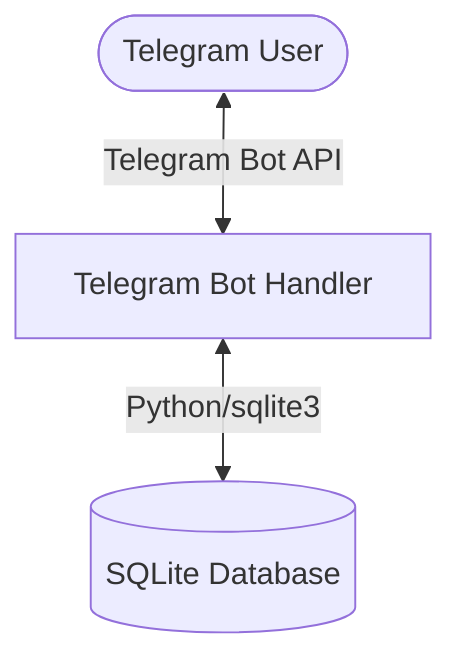

# Specification: Build core chatbot commands and database integration

## Overview
This track implements the MVP (Minimum Viable Product) for the Savings & Financial Transaction Telegram Chatbot. The goal is to build a fully functional, lightweight personal chatbot that allows a single user to log daily transactions (debits/credits) and view running balances, transaction history, and simple weekly/monthly aggregates directly from Telegram.

## Scope
1. **Database Integration:** SQLite database containing a `transactions` table with:
   - `id`: INTEGER PRIMARY KEY AUTOINCREMENT
   - `date`: TEXT (ISO 8601 `YYYY-MM-DD` format)
   - `amount`: REAL (always positive)
   - `description`: TEXT
   - `type`: TEXT (`debit` or `credit`)
   - `balance_after`: REAL (running balance cached at the transaction time)
2. **Commands & Interaction flows:**
   - `/start` - Displays greeting and usage guidance.
   - `/help` - Displays command descriptions.
   - `/balance` - Shows the current running net balance.
   - `/view` - Displays the last 10 transactions in a formatted, readable layout.
   - `/summary` - Displays weekly and monthly transaction summaries (credits vs debits) grouped by category/description.
   - `/add` - Initiates transaction adding workflow:
     - Prompts for Type (debit/credit) using inline buttons.
     - Prompts for Amount (must be a positive number).
     - Prompts for Category/Description (text).
     - Prompts for Date (defaults to today, with manual override or confirmation buttons).
     - Recalculates balance, stores the record, and prints confirmation.
3. **Quality Gates:**
   - Test-Driven Development (TDD) cycle for all components.
   - Test coverage >80%.
   - Docker configuration for easy VPS hosting.

## System Architecture

## Technical Decisions
- **Telegram Library:** `python-telegram-bot` (v20+) with `asyncio` for robust asynchronous updates.
- **Database:** Standard library `sqlite3` to avoid heavy external database servers.
- **Testing:** `pytest` and `pytest-asyncio` for mocking Telegram updates and testing DB logic.
- **Deployment:** Docker to package the chatbot as a single service.

## Acceptance Criteria
- Commands `/start`, `/help`, `/balance`, `/view`, and `/summary` return correct formatted responses.
- The `/add` conversational workflow successfully parses user responses and writes valid records to the SQLite DB.
- Invalid input formats (e.g., negative amounts or non-numeric entries) are handled gracefully with helpful hints.
- Code coverage is greater than 80%.
- A container can be built using Docker and run locally without errors.
